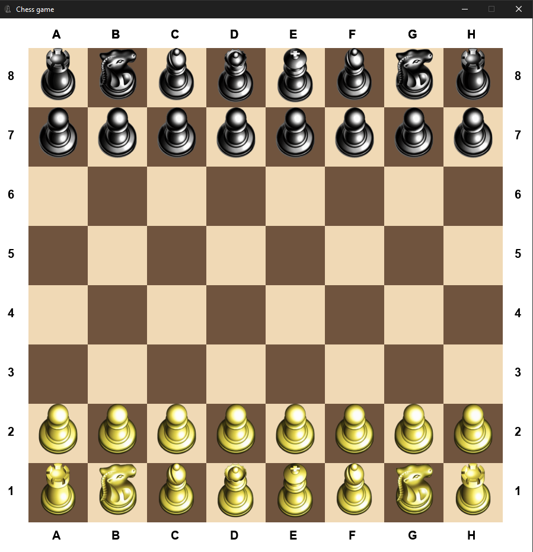

# ♟️ Engine Chessgame


Logic for a chess game built with Python and Pygame. This project implements a full-featured chess engine logic with a focus on Object-Oriented Programming (OOP) principles.

---

### 🧰 Core Features

* **Complete Chess Rules**: Implements all standard moves for every piece.
* **Special Moves Support**:
    * **Castling**: Handles logic for both kingside and queenside castling.
    * **En Passant**: Correct validation for the tricky "in passing" pawn capture.
    * **Pawn Promotion**: Logic to transform pawns reaching the last rank.
* **Movement Validation**: Audit for check/checkmate and stalemate conditions.
* **Custom Assets**: Uses specialized sprites for pieces for a clean look.

### 🎮 Gameplay Screenshots

| Board Setup | Logic in Action |
| :---: | :---: |
|  | 

### 🚀 Stack & Tools
* **Language**: **Python** — backend engine and game logic.
* **UI/UX**: **Pygame** — handling board rendering and user inputs.
* **Architecture**: **OOP** — Modular piece classes, board state management, and clear game-loop logic.

### 🔩 How to run:
1. **Clone the repository**:

   ```bash
   git clone [https://github.com/nzr-xdev/engine_chessgame.git](https://github.com/nzr-xdev/engine_chessgame.git)
2. **Import requirements**:

    ```bash
    pip install -r requirements.txt

3. **Run game**:

    ```bash
    python "chess.py"
